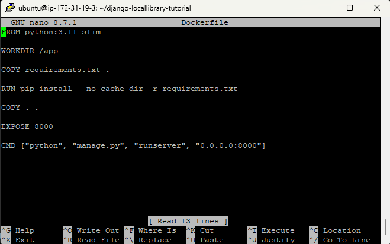
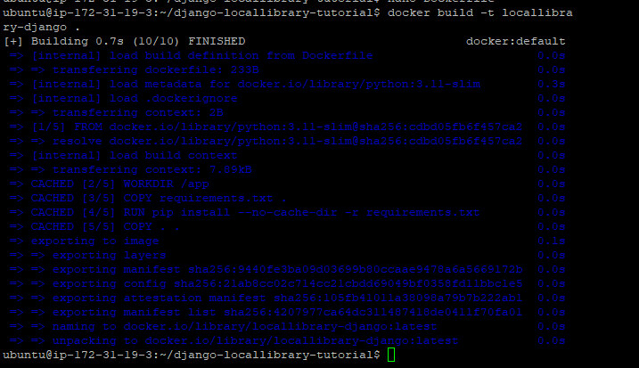
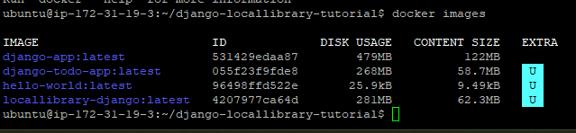
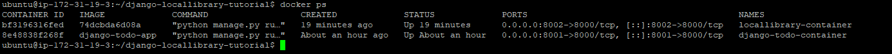
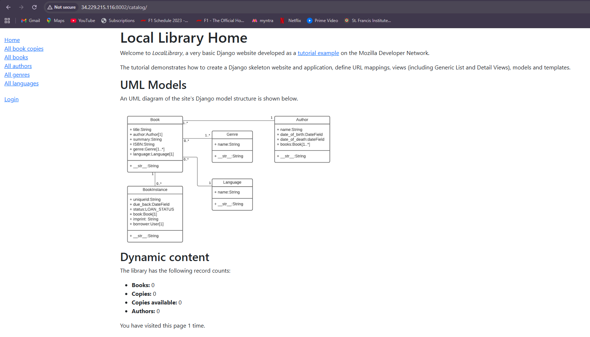
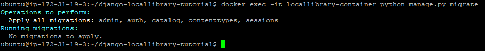
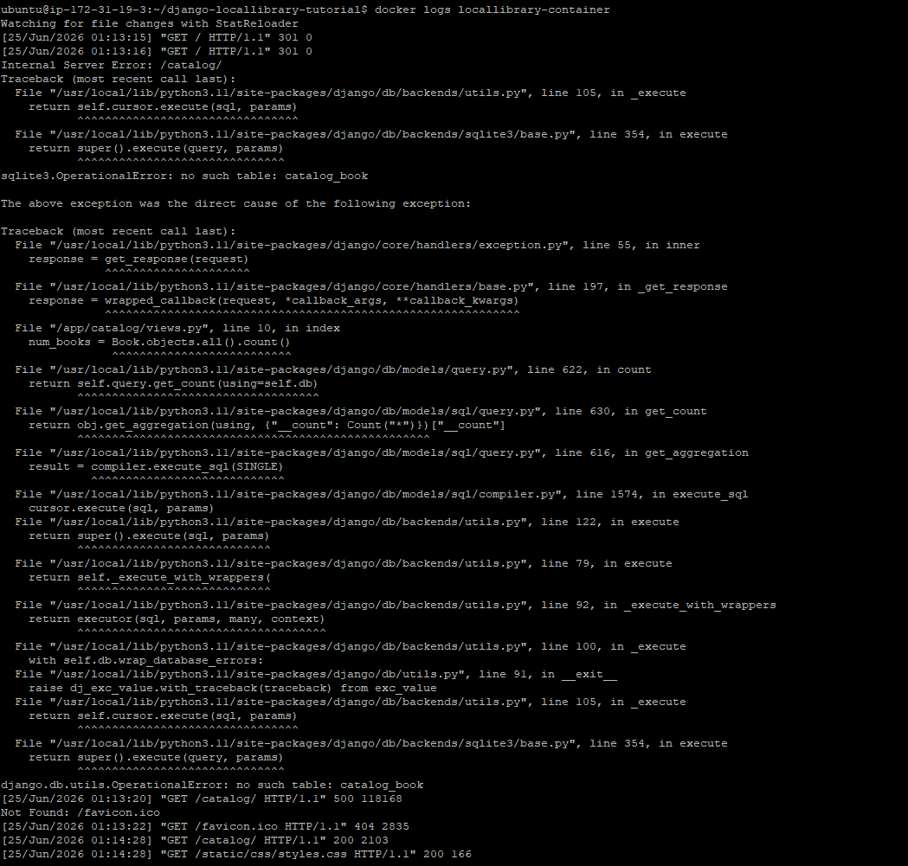

# Dockerized Django Local Library

A Dockerized Django Local Library application deployed on an AWS EC2 Ubuntu instance.

---

## Project Overview

This project demonstrates how to containerize a Django web application using Docker and deploy it on an AWS EC2 Ubuntu instance.

The application used in this project is based on the **MDN Django Local Library** tutorial. A custom Dockerfile was created to build a Docker image, run the application inside a container, expose it through a custom port, and access it from a web browser.

---

## Features

* Containerized an existing Django application using Docker
* Built a custom Docker image
* Deployed the application inside a Docker container
* Configured Docker port mapping
* Ran Django database migrations inside the container
* Accessed the application using an AWS EC2 public IP

---

## Technologies Used

* Python
* Django
* Docker
* AWS EC2
* Ubuntu Linux
* Git
* GitHub

---

## Project Structure

```text
dockerized-django-locallibrary/
│
├── catalog/
├── locallibrary/
├── screenshots/
│   ├── 01-dockerfile.png
│   ├── 02-docker-build-success.png
│   ├── 03-docker-images.png
│   ├── 04-container-running.png
│   ├── 05-browser-output.png
│   ├── 06-database-migration.png
│   └── 07-docker-logs.png
│
├── Dockerfile
├── manage.py
├── requirements.txt
├── README.md
└── db.sqlite3
```

---

## Dockerfile

```dockerfile
FROM python:3.11-slim

WORKDIR /app

COPY requirements.txt .

RUN pip install --no-cache-dir -r requirements.txt

COPY . .

EXPOSE 8000

CMD ["python", "manage.py", "runserver", "0.0.0.0:8000"]
```

---

## Prerequisites

Before running the project, ensure you have:

* Docker installed
* Git installed
* AWS EC2 Ubuntu instance (or any Linux machine)

---

## Clone the Repository

```bash
git clone https://github.com/<your-username>/dockerized-django-locallibrary.git

cd dockerized-django-locallibrary
```

---

## Build Docker Image

```bash
docker build -t locallibrary-django .
```

---

## Verify Docker Image

```bash
docker images
```

---

## Run Docker Container

```bash
docker run -d -p 8002:8000 --name locallibrary-container locallibrary-django
```

---

## Verify Running Container

```bash
docker ps
```

---

## Apply Database Migrations

```bash
docker exec -it locallibrary-container python manage.py migrate
```

---

## View Container Logs

```bash
docker logs locallibrary-container
```

---

## Access the Application

Open your browser and visit:

```text
http://<EC2-PUBLIC-IP>:8002/catalog/
```

---

# Project Workflow

```text
Clone Repository
        │
        ▼
Create Dockerfile
        │
        ▼
Build Docker Image
        │
        ▼
Run Docker Container
        │
        ▼
Run Django Migrations
        │
        ▼
Access Application from Browser
```

---

# Screenshots

## Dockerfile



---

## Docker Image Build



---

## Docker Images



---

## Running Docker Container



---

## Django Application Running



---

## Database Migration



---

## Docker Logs



---

# Key Learnings

* Understood the purpose of Docker images and containers.
* Created a Dockerfile to package a Django application.
* Built Docker images from application source code.
* Ran a Django application inside a Docker container.
* Configured Docker port mapping to expose the application.
* Executed Django database migrations within a running container.
* Deployed and tested the application on an AWS EC2 Ubuntu instance.

---

# Useful Docker Commands

```bash
# Build Docker image
docker build -t locallibrary-django .

# List Docker images
docker images

# Run Docker container
docker run -d -p 8002:8000 --name locallibrary-container locallibrary-django

# List running containers
docker ps

# View container logs
docker logs locallibrary-container

# Execute database migrations
docker exec -it locallibrary-container python manage.py migrate

# Stop the container
docker stop locallibrary-container

# Remove the container
docker rm locallibrary-container
```

---

# Future Improvements

* Deploy the application using Docker Compose.
* Replace SQLite with PostgreSQL.
* Configure Nginx as a reverse proxy.
* Automate deployment using GitHub Actions.
* Deploy to a cloud container platform.

---

# Acknowledgement

This project uses the Django Local Library application from the MDN Web Docs tutorial for educational purposes.

Original project:

https://github.com/mdn/django-locallibrary-tutorial

---

## Author

**Swen Lemos**
